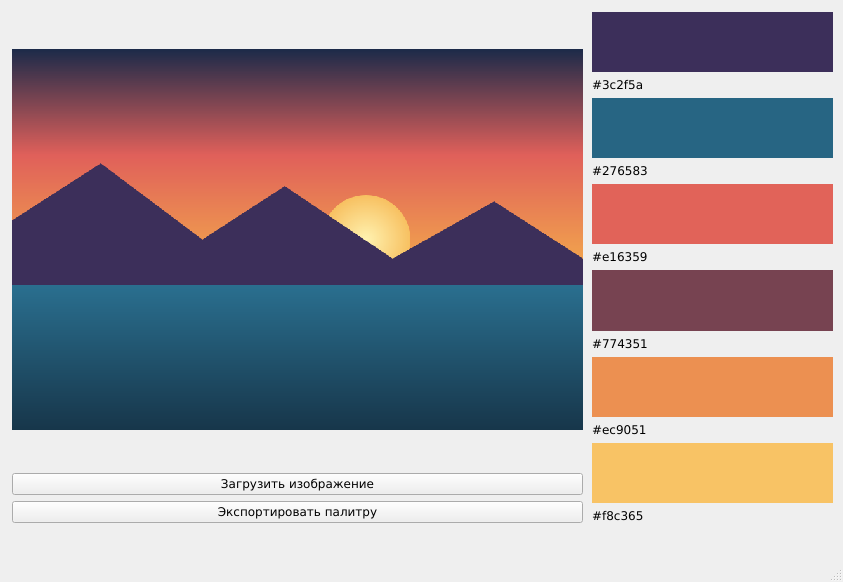

<div align="center">

# Учебные проекты на C++

**Лабораторные работы, курсовая и учебная практика · СПбГЭТУ «ЛЭТИ» · 2022–2023**

[](https://en.cppreference.com/w/cpp/17)
[](https://www.qt.io/)
[](https://cmake.org/)
[](https://github.com/zubrovvka/projects/actions/workflows/ci.yml)
[](LICENSE)

[English version](README.en.md)



<sub>Palette Extractor — Qt-приложение из учебной практики</sub>

</div>

---

## Содержание

| # | Проект | Тема | Что внутри |
|:-:|--------|------|------------|
| 1 | [**Сортировочная станция**](algorithms-and-data-structures/01-shunting-yard/) | Перевод выражения в обратную польскую запись | Собственные шаблонные `List<T>` (стек) и `dynamic_array<T>`, приоритеты операций, `sin`/`cos`, скобки |
| 2 | [**TimSort и QuickSort**](algorithms-and-data-structures/02-timsort-quicksort/) | Алгоритмы сортировки | TimSort с нуля (minrun → сортировка вставками → слияние), быстрая сортировка Хоара, замер времени |
| 3 | [**AVL-дерево**](algorithms-and-data-structures/03-avl-tree/) | Самобалансирующиеся деревья поиска | Вставка, удаление, 4 вида поворотов, обходы pre/in/post-order и BFS, ASCII-визуализация |
| 4 | [**Графы: DFS, BFS, Крускал**](algorithms-and-data-structures/coursework-graph-mst/) · *курсовая* | Алгоритмы на графах | Чтение матрицы смежности из файла, обходы, минимальное остовное дерево через систему непересекающихся множеств |
| 5 | [**Palette Extractor**](palette-extractor/) · *практика* | Обработка изображений, GUI | Qt 6 Widgets: находит 6 доминирующих цветов PNG/JPG/BMP с учётом перцептивного расстояния, экспорт палитры |

Подробное описание задачи, алгоритма и примеры запуска — в `README.md` каждого проекта.

## Быстрый старт

Консольные проекты (1–4) собираются одной командой на Linux, macOS и Windows:

```bash
git clone https://github.com/zubrovvka/projects.git
cd projects
cmake -S . -B build -DCMAKE_BUILD_TYPE=Release
cmake --build build
```

Бинарники появятся в `build/algorithms-and-data-structures/<проект>/`:

```bash
./build/algorithms-and-data-structures/01-shunting-yard/shunting-yard
./build/algorithms-and-data-structures/02-timsort-quicksort/sorting
./build/algorithms-and-data-structures/03-avl-tree/avl-tree
(cd build/algorithms-and-data-structures/coursework-graph-mst && ./graph-mst)
```

Qt-приложение требует установленного Qt 6 и включается флагом:

```bash
cmake -S . -B build -DBUILD_PALETTE_EXTRACTOR=ON -DCMAKE_PREFIX_PATH=/path/to/Qt/6.x/gcc_64
cmake --build build
```

Готовая сборка Palette Extractor под Windows x64 лежит в [`palette-extractor/dist/`](palette-extractor/dist/).

## Структура репозитория

```
.
├── algorithms-and-data-structures/     # курс «Алгоритмы и структуры данных»
│   ├── 01-shunting-yard/               # лаб. 1 — обратная польская запись
│   ├── 02-timsort-quicksort/           # лаб. 2 — сортировки
│   ├── 03-avl-tree/                    # лаб. 3 — AVL-дерево
│   └── coursework-graph-mst/           # курсовая — графы (DFS/BFS/Крускал)
│       ├── src/
│       └── examples/                   # примеры входных файлов
├── palette-extractor/                  # учебная практика — Qt-приложение
│   ├── src/                            # исходники (CMake + qmake)
│   ├── docs/                           # отчёт по практике, скриншоты
│   ├── examples/                       # тестовое изображение
│   └── dist/                           # готовая сборка для Windows
├── CMakeLists.txt                      # корневая сборка
├── .clang-format                       # единый стиль кода
└── .github/workflows/ci.yml            # сборка на Linux и Windows
```

## Инструменты

- **Язык:** C++17
- **Сборка:** CMake ≥ 3.16 (для Qt-проекта также оставлен `.pro`-файл qmake)
- **GUI:** Qt 6 Widgets
- **Стиль:** `clang-format` (конфиг в корне), `.editorconfig`
- **CI:** GitHub Actions — GCC на Ubuntu и MSVC на Windows

## Авторы

- **[zubrovvka](https://github.com/zubrovvka)** — лабораторные работы и курсовая
- Учебная практика выполнена в команде: **Зырянов В. М., Колпачев В. Ю., Москвин С. О.** (гр. 1374), куратор — Прокопович Ю. В.

## Лицензия

[MIT](LICENSE)
