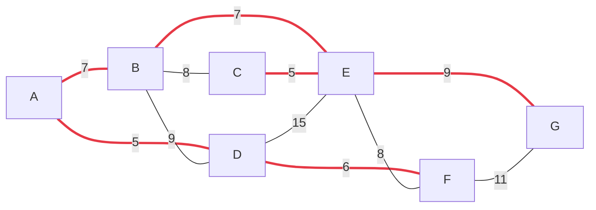

# Курсовая работа — Графы: DFS, BFS и алгоритм Крускала

Программа читает взвешенный неориентированный граф из текстового файла в виде матрицы смежности и выполняет над ним обход в глубину, обход в ширину и поиск минимального остовного дерева.

## Формат входного файла

Первая строка — имена вершин, далее квадратная матрица весов (0 — ребра нет). Разделитель — табуляция или пробел. Ограничения: не более 50 вершин, веса от 0 до 1023.

```
A	B	C	D	E	F	G
0	7	0	5	0	0	0
7	0	8	9	7	0	0
0	8	0	0	5	0	0
5	9	0	0	15	6	0
0	7	5	15	0	8	9
0	0	0	6	8	0	11
0	0	0	0	9	11	0
```

Примеры лежат в [`examples/`](examples/): связный граф `graph.txt` и несвязный `graph-disconnected.txt`.

## Запуск

```bash
./graph-mst                      # читает examples/graph.txt
./graph-mst path/to/my-graph.txt # или любой другой файл
```

```
File examples/graph.txt was read successfully
 Select Option number.
0. Run Kruskal algorithm
1. Run depth-first search algorithm
2. Run breadth-first search algorithm
3. Print adjacency matrix
1
DFS Route is: A B C E D F G
...
2
BFS Route is: A B D C E F G
...
0
1. A D
2. A B
3. B E
4. C E
5. D F
6. E G

 Min route weight is:
 39
```

Пункты 1–3 можно вызывать сколько угодно раз, пункт 0 запускает алгоритм Крускала и завершает программу.



<sub>Красным выделены рёбра минимального остовного дерева (суммарный вес 39).</sub>

## Алгоритмы

### Обход в глубину (DFS)

Рекурсивный: помечаем вершину посещённой, печатаем, идём в первого непосещённого соседа по строке матрицы. **O(V²)** для матрицы смежности.

### Обход в ширину (BFS)

Итеративный, с собственной очередью `QueueArray`: вершина извлекается из головы, все её непосещённые соседи помечаются и ставятся в хвост. **O(V²)**.

### Алгоритм Крускала

1. Все рёбра (только верхний треугольник матрицы, чтобы не дублировать) складываются в `edgeArray`.
2. Рёбра сортируются по весу пузырьком.
3. Для каждой вершины создаётся своё множество в `DynArray` (система непересекающихся множеств — `findset` / `unionset`).
4. Рёбра перебираются по возрастанию веса: если концы лежат в разных множествах, ребро добавляется в остов и множества объединяются. Останавливаемся, когда набрано `V − 1` рёбер или рёбра закончились.
5. Рёбра остова выводятся, отсортированные по первой вершине; для несвязного графа печатается предупреждение и возвращается минимальный остовный **лес**.

Сложность с пузырьковой сортировкой — **O(E²)**; с `std::sort` и сжатием путей в DSU была бы O(E log E).

## Структура кода

| Файл | Содержимое |
|------|-----------|
| `main.cpp` | точка входа, чтение рёбер, алгоритм Крускала |
| `app.h` / `app.cpp` | класс `App`: парсинг файла с проверкой ошибок, меню, печать матрицы, DFS и BFS |
| `dyn_array.h` / `.cpp` | `DynArray` — динамический массив `int`, дополненный `findset` / `unionset` (DSU) |
| `queue_array.h` / `.cpp` | `QueueArray` — очередь на массиве для BFS |
| `edge.h` | структура ребра `{from, to, weight}` |
| `edge_array.h` | `edgeArray` — динамический массив рёбер |

## Сборка

```bash
g++ -std=c++17 -O2 -o graph-mst src/*.cpp
./graph-mst examples/graph.txt
```

или через CMake из корня репозитория — примеры автоматически копируются рядом с бинарником.
